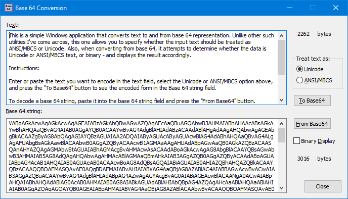

# B64Util - A Windows GUI program to convert between base 64 and Unicode or ANSI/MBCS text

This is a simple Windows application that converts text to and from base 64 representation.

Unlike several other such utilities I've come across, this allows you to specify whether the input text should be treated as ANSI/MBCS or Unicode. Also, when converting from base 64, it attempts to determine whether the data is Unicode or ANSI/MBCS text, or binary - and displays the result accordingly.

## Instructions

Enter or paste the text you want to encode in the text field, select the Unicode or ANSI/MBCS option, and press the "To Base64" button to see the encoded form in the Base 64 string field.

To decode a base 64 string, paste it into the base 64 string field and press the "From Base64" button.

If the decoded data appears to be text it will be shown in the text field and the Unicode or ANSI option above will be set accordingly. If the decoded data appears to be binary, it will be shown in this field as pairs of hexadecimal characters for each byte of data. Because the determination of text or binary is not foolproof you can select the "Binary Display" check box to force the display to the binary format.

